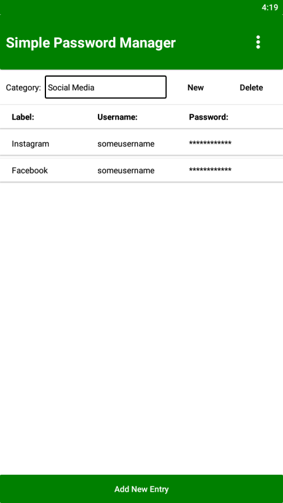
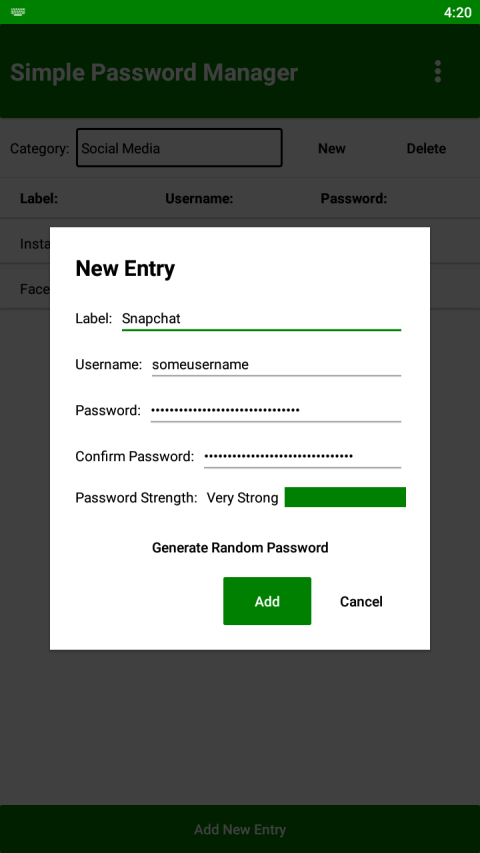

Simple Password Manager 
===========================
A password manager for Android and iOS written in Xamarin.Forms.

Features
===========================
- Random password generator - create a cryptographically secure password using the random password generator. Either create a typical random letter / number / symbol password or an XKCD password.
- Encrypted password database - protect your password database from unwanted access by encrypting the database.

Screenshots
===========================

Author
===========================
Written by: Marvin Manese
